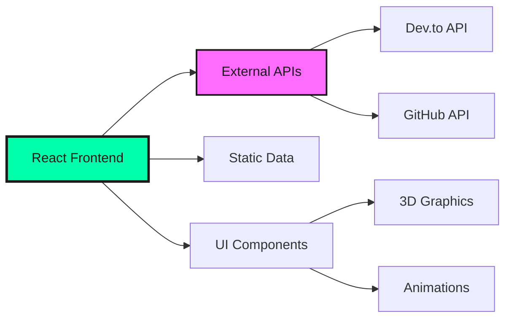

# 🚀 Modern Dynamic Portfolio

> **A cutting-edge, interactive portfolio website showcasing modern web development with React, TypeScript, and stunning 3D animations.**

[](https://your-portfolio-url.com)
[](https://www.linkedin.com/in/prakash-maheshwaran/)

## ✨ Features

- 🎨 **3D Interactive Scenes** - React Three Fiber powered animations
- ⚡ **High Performance** - Optimized loading and rendering
- 📱 **Fully Responsive** - Works on all devices
- 🔗 **Dynamic Content** - Real-time blog posts and GitHub projects
- ♿ **Accessible** - WCAG compliant with keyboard navigation

---

## 🚀 Quick Start Guide

### Prerequisites
```bash
Node.js 16+ and npm/yarn
Modern browser with WebGL support
```

### 1️⃣ Installation
```bash
# Clone the repository
git clone https://github.com/yourusername/Modern-Dynamic-Portfolio.git
cd Modern-Dynamic-Portfolio

# Install dependencies
npm install --legacy-peer-deps

# Alternative with yarn
yarn install
```

### 2️⃣ Environment Setup
```bash
# Copy environment template
cp env.sample .env

# Edit .env with your configuration
nano .env
```

### 3️⃣ Launch Development Server
```bash
npm start
# Opens http://localhost:3000
```

### 4️⃣ Build for Production
```bash
npm run build
# Creates optimized build in ./build directory
```

---

## ⚙️ Configuration

### Environment Variables

| Variable | Required | Description | Example |
|----------|----------|-------------|---------|
| `REACT_APP_BLOG_WEBHOOK_URL` | No | Blog posts API endpoint | `https://dev.to/api/articles?username=yourusername` |
| `REACT_APP_PROJECT_WEBHOOK_URL` | No | GitHub projects API endpoint | `https://api.github.com/users/yourusername/repos` |

**📝 See `env.sample` for complete configuration options**

### API Integration

#### Blog Posts (Dev.to Compatible)
```bash
# Dev.to API (recommended)
REACT_APP_BLOG_WEBHOOK_URL=https://dev.to/api/articles?username=yourusername&per_page=20

# Custom webhook
REACT_APP_BLOG_WEBHOOK_URL=https://your-webhook.com/api/blogs
```

#### GitHub Projects
```bash
# GitHub API (recommended)
REACT_APP_PROJECT_WEBHOOK_URL=https://api.github.com/users/yourusername/repos?sort=updated

# Custom webhook
REACT_APP_PROJECT_WEBHOOK_URL=https://your-webhook.com/api/projects
```

**📚 Full API documentation available in [`docs/API_DOCUMENTATION.md`](docs/API_DOCUMENTATION.md)**

---

## 🏗️ Architecture



Simple React frontend that fetches data from external APIs (Dev.to, GitHub) with fallback to static data.

---

## 🛠️ Technology Stack

### **Frontend Framework**
- **React 18** - Latest features with concurrent rendering
- **TypeScript** - Type-safe development with enhanced DX
- **Styled Components** - CSS-in-JS with theme support

### **3D Graphics & Animation**
- **React Three Fiber** - Declarative 3D scenes
- **Three.js** - WebGL-powered 3D graphics engine
- **Framer Motion** - Smooth animations and transitions

### **Development & Build**
- **Create React App** - Zero-config build tooling
- **ESLint** - Code quality and consistency
- **Webpack** - Module bundling and optimization

### **External Integrations**
- **Dev.to API** - Dynamic blog content
- **GitHub API** - Repository information
- **React Icons** - Comprehensive icon library


## 📁 Project Structure

```
src/
├── components/          # React components by feature
│   ├── Hero/           # 3D hero section with animations
│   ├── About/          # About section with timeline
│   ├── Projects/       # Dynamic project gallery
│   ├── Skills/         # 3D skills visualization
│   ├── Blog/           # Dynamic blog section
│   ├── Navigation/     # Responsive navigation
│   └── UI/             # Shared UI components
├── hooks/              # Custom React hooks
│   ├── useBlogData.ts  # Blog API integration
│   ├── useProjectsData.ts # GitHub API integration
│   └── useScrollSpy.ts # Navigation scroll spy
├── config/             # Configuration files
│   ├── blogConfig.ts   # Blog API configuration
│   └── projectsConfig.ts # Projects API configuration
├── data/               # Static data files
├── styles/             # Global styles and themes
├── utils/              # Utility functions
└── types/              # TypeScript type definitions
```

---

---

## 📄 License

This project is open source and available under the [MIT License](LICENSE).

---

## 📞 Connect & Support

### **Professional Links**
[](https://your-portfolio-url.com)
[](https://www.linkedin.com/in/prakash-maheshwaran/)
[](mailto:diinoprakash@gmail.com)

### **Support the Project**
⭐ **Star this repository** if it helped you!  
🐛 **Report issues** to help improve the project  
🚀 **Share with others** who might find it useful  
💡 **Contribute** to make it even better  

---

<div align="center">

**Built with 💚 by Prakash Maheshwaran | MS in Computer Science @ SUNY Binghamton**

</div>