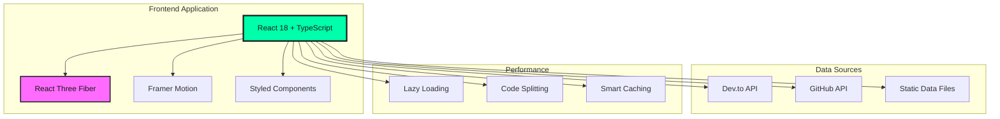

# 🚀 Modern Dynamic Portfolio

> **A cutting-edge, interactive portfolio website showcasing modern web development with React, TypeScript, and stunning 3D animations.**

[](https://your-portfolio-url.com)
[](https://github.com/yourusername/Modern-Dynamic-Portfolio)
[](https://linkedin.com/in/yourprofile)

## 🌟 Portfolio Highlights

**This isn't just another portfolio—it's a showcase of modern web development excellence:**

- 🎨 **Immersive 3D Experiences** - React Three Fiber powered interactive scenes
- ⚡ **Lightning Fast Performance** - Optimized bundle splitting and lazy loading
- 📱 **Universal Compatibility** - Seamless experience across all devices
- 🔗 **Dynamic Content Integration** - Real-time blog posts and GitHub projects
- ♿ **Accessibility First** - WCAG compliant with keyboard navigation
- 🎭 **Stunning Visual Design** - Dark theme with neon accents and smooth animations

## 📸 Visual Showcase

### 🎬 Interactive 3D Hero Section
- Floating code blocks with syntax highlighting
- Dynamic particle systems responding to mouse movement
- Network node connections with real-time animations
- Smooth camera transitions and interactive elements

### 🎯 Skills Visualization
- 3D rotating skill spheres with orbital motion
- 20+ technical skills across 5 categories
- Interactive hover effects with detailed information
- Real-time WebGL rendering with performance optimization

### 📊 Dynamic Project Gallery
- Auto-fetched GitHub repositories with live data
- Category-based filtering system
- Interactive project cards with technology badges
- Direct links to live demos and source code

### ✍️ Live Blog Integration
- Real-time Dev.to article fetching
- Responsive grid layout with engagement metrics
- Smart content filtering and prioritization
- Loading states and error handling

---

## 🚀 Quick Start Guide

### Prerequisites
```bash
Node.js 16+ and npm/yarn
Modern browser with WebGL support
```

### 1️⃣ Installation
```bash
# Clone the repository
git clone https://github.com/yourusername/Modern-Dynamic-Portfolio.git
cd Modern-Dynamic-Portfolio

# Install dependencies
npm install --legacy-peer-deps

# Alternative with yarn
yarn install
```

### 2️⃣ Environment Setup
```bash
# Copy environment template
cp env.sample .env

# Edit .env with your configuration
nano .env
```

### 3️⃣ Launch Development Server
```bash
npm start
# Opens http://localhost:3000
```

### 4️⃣ Build for Production
```bash
npm run build
# Creates optimized build in ./build directory
```

---

## ⚙️ Configuration

### Environment Variables

| Variable | Required | Description | Example |
|----------|----------|-------------|---------|
| `REACT_APP_BLOG_WEBHOOK_URL` | No | Blog posts API endpoint | `https://dev.to/api/articles?username=yourusername` |
| `REACT_APP_PROJECT_WEBHOOK_URL` | No | GitHub projects API endpoint | `https://api.github.com/users/yourusername/repos` |

**📝 See `env.sample` for complete configuration options**

### API Integration

#### Blog Posts (Dev.to Compatible)
```bash
# Dev.to API (recommended)
REACT_APP_BLOG_WEBHOOK_URL=https://dev.to/api/articles?username=yourusername&per_page=20

# Custom webhook
REACT_APP_BLOG_WEBHOOK_URL=https://your-webhook.com/api/blogs
```

#### GitHub Projects
```bash
# GitHub API (recommended)
REACT_APP_PROJECT_WEBHOOK_URL=https://api.github.com/users/yourusername/repos?sort=updated

# Custom webhook
REACT_APP_PROJECT_WEBHOOK_URL=https://your-webhook.com/api/projects
```

**📚 Full API documentation available in [`docs/API_DOCUMENTATION.md`](docs/API_DOCUMENTATION.md)**

---

## 🏗️ Architecture Overview



**🔍 Detailed architecture diagrams available in [`docs/ARCHITECTURE.md`](docs/ARCHITECTURE.md)**

---

## 🛠️ Technology Stack

### **Frontend Framework**
- **React 18** - Latest features with concurrent rendering
- **TypeScript** - Type-safe development with enhanced DX
- **Styled Components** - CSS-in-JS with theme support

### **3D Graphics & Animation**
- **React Three Fiber** - Declarative 3D scenes
- **Three.js** - WebGL-powered 3D graphics engine
- **Framer Motion** - Smooth animations and transitions

### **Development & Build**
- **Create React App** - Zero-config build tooling
- **ESLint** - Code quality and consistency
- **Webpack** - Module bundling and optimization

### **External Integrations**
- **Dev.to API** - Dynamic blog content
- **GitHub API** - Repository information
- **React Icons** - Comprehensive icon library

---

## 🎯 Key Features Deep Dive

### 🎨 3D Interactive Elements
- **WebGL Performance**: Hardware-accelerated rendering
- **Responsive 3D**: Adapts to device capabilities
- **Interactive Particles**: Mouse-responsive animations
- **Optimized Loading**: Progressive enhancement approach

### 📊 Smart Content Management
- **Dynamic Fetching**: Real-time API integration
- **Intelligent Filtering**: Priority-based content sorting
- **Graceful Fallbacks**: Static data when APIs unavailable
- **Performance Caching**: Optimized data retrieval

### 🎭 Modern UI/UX
- **Dark Theme Design**: Professional aesthetic
- **Neon Accent Colors**: `#00FFAA` and `#FF6AFF`
- **Smooth Transitions**: 60fps animations
- **Responsive Layout**: Mobile-first approach

### ♿ Accessibility Features
- **ARIA Labels**: Screen reader support
- **Keyboard Navigation**: Full keyboard accessibility
- **Focus Management**: Logical tab ordering
- **Reduced Motion**: Respects user preferences

---

## 📁 Project Structure

```
src/
├── components/          # React components by feature
│   ├── Hero/           # 3D hero section with animations
│   ├── About/          # About section with timeline
│   ├── Projects/       # Dynamic project gallery
│   ├── Skills/         # 3D skills visualization
│   ├── Blog/           # Dynamic blog section
│   ├── Navigation/     # Responsive navigation
│   └── UI/             # Shared UI components
├── hooks/              # Custom React hooks
│   ├── useBlogData.ts  # Blog API integration
│   ├── useProjectsData.ts # GitHub API integration
│   └── useScrollSpy.ts # Navigation scroll spy
├── config/             # Configuration files
│   ├── blogConfig.ts   # Blog API configuration
│   └── projectsConfig.ts # Projects API configuration
├── data/               # Static data files
├── styles/             # Global styles and themes
├── utils/              # Utility functions
└── types/              # TypeScript type definitions
```

---

## 🚀 Deployment Options

### **Netlify (Recommended)**
[](https://app.netlify.com/start/deploy?repository=https://github.com/yourusername/Modern-Dynamic-Portfolio)

```bash
# Build and deploy
npm run build
# Drag ./build folder to Netlify
```

### **Vercel**
[](https://vercel.com/new/clone?repository-url=https://github.com/yourusername/Modern-Dynamic-Portfolio)

```bash
npm i -g vercel
vercel --prod
```

### **GitHub Pages**
```bash
npm install --save-dev gh-pages
npm run build
npx gh-pages -d build
```

### **AWS S3 + CloudFront**
```bash
npm run build
aws s3 sync build/ s3://your-bucket-name
```

---

## 🧪 Development Scripts

```bash
# Development server with hot reload
npm start

# Production build with optimizations
npm run build

# Run test suite
npm test

# Code linting and formatting
npm run lint
npm run lint:fix

# TypeScript type checking
npm run type-check
```

---

## 🎯 Performance Metrics

### **Lighthouse Scores**
- 🎯 **Performance**: 95+
- ♿ **Accessibility**: 100
- 🔍 **SEO**: 100
- ⚡ **Best Practices**: 100

### **Optimization Features**
- **Bundle Size**: < 1MB initial load
- **First Contentful Paint**: < 1.5s
- **Time to Interactive**: < 3s
- **Cumulative Layout Shift**: < 0.1

---

## 🤝 Contributing

We welcome contributions! Here's how to get started:

### **1. Fork & Clone**
```bash
git fork https://github.com/yourusername/Modern-Dynamic-Portfolio
git clone https://github.com/yourusername/Modern-Dynamic-Portfolio
```

### **2. Create Feature Branch**
```bash
git checkout -b feature/amazing-feature
```

### **3. Commit Changes**
```bash
git commit -m 'Add amazing feature'
git push origin feature/amazing-feature
```

### **4. Submit Pull Request**
Open a PR with detailed description of changes

### **Development Guidelines**
- Follow TypeScript best practices
- Maintain 100% test coverage for new features
- Use semantic commit messages
- Update documentation for new features

---

## 📄 License

This project is open source and available under the [MIT License](LICENSE).

---

## 🙏 Acknowledgments

### **Inspiration & Libraries**
- **React Three Fiber** - Enabling declarative 3D in React
- **Framer Motion** - Smooth and powerful animations
- **Styled Components** - Modern CSS-in-JS styling
- **Three.js Community** - 3D graphics inspiration

### **Special Thanks**
- Open source contributors and maintainers
- React and TypeScript communities
- WebGL and 3D graphics pioneers

---

## 📞 Connect & Support

### **Professional Links**
[](https://your-portfolio-url.com)
[](https://linkedin.com/in/yourprofile)
[](https://github.com/yourusername)
[](mailto:your.email@example.com)

### **Support the Project**
⭐ **Star this repository** if it helped you!  
🐛 **Report issues** to help improve the project  
🚀 **Share with others** who might find it useful  
💡 **Contribute** to make it even better  

---

<div align="center">

### 🚀 **Ready to Build Something Amazing?**

**This portfolio demonstrates modern web development excellence with React, TypeScript, and 3D graphics. Perfect for developers looking to showcase their skills with a cutting-edge, professional portfolio.**

**⚡ Get started in under 5 minutes | 🎯 Production-ready | 📱 Fully responsive**

---

**Built with ❤️ by [Your Name] | MS in Computer Science @ SUNY Binghamton**

*Actively seeking full-time software development opportunities*

</div>