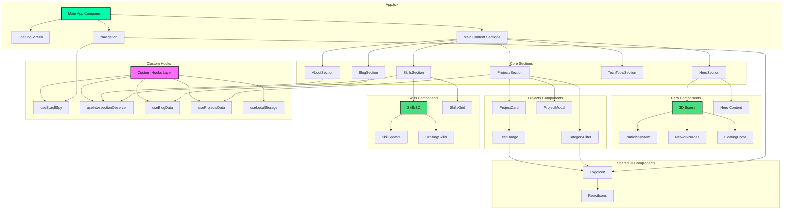
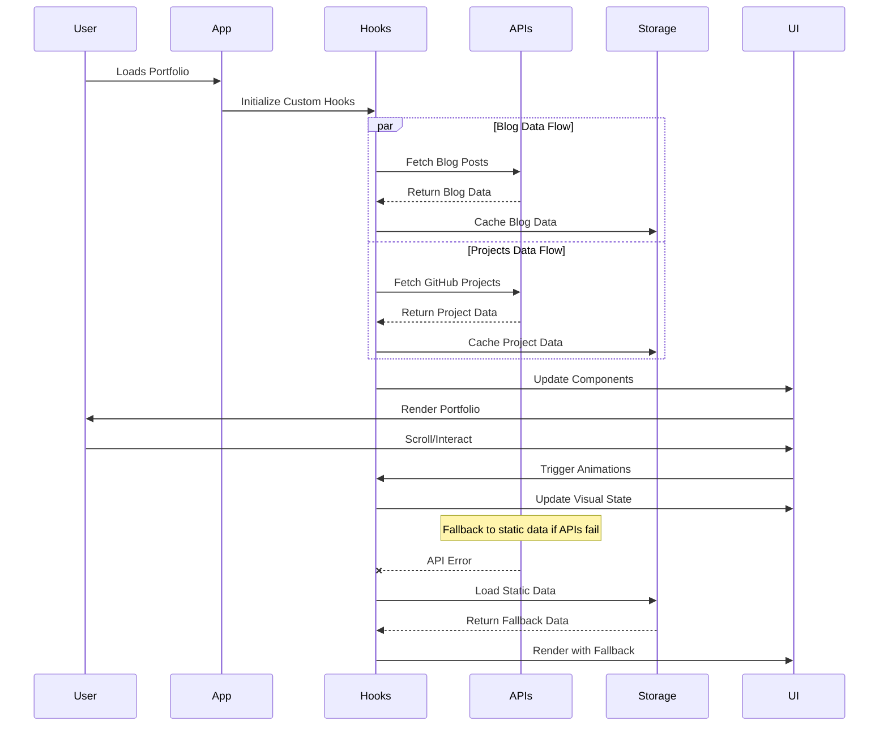
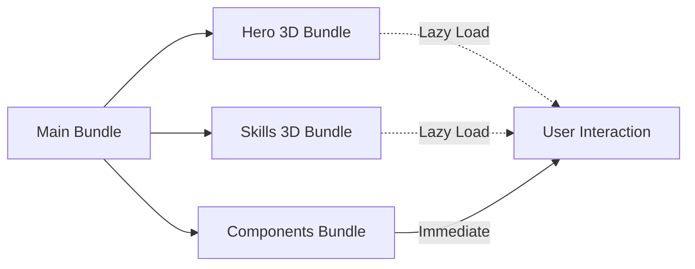
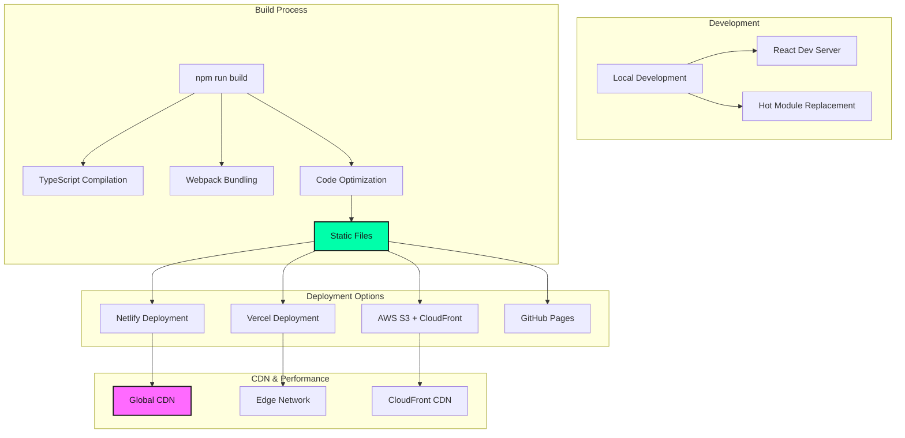

# Architecture Overview

## System Architecture Diagram

```mermaid
graph TB
    subgraph "Client Browser"
        App[React Application]
        App --> Hero[Hero Section with 3D]
        App --> About[About Section]
        App --> Projects[Projects Gallery]
        App --> Skills[Skills Visualization]
        App --> Blog[Blog Section]
        App --> Contact[Contact Form]
    end

    subgraph "Data Layer"
        StaticData[Static Data Files]
        StaticData --> ProjectsData[projectsData.ts]
        StaticData --> SkillsData[skillsData.ts]
        StaticData --> TechToolsData[techToolsData.ts]
    end

    subgraph "External APIs"
        DevToAPI[Dev.to API]
        GitHubAPI[GitHub API]
        CustomWebhook[Custom Webhooks]
    end

    subgraph "Configuration"
        EnvConfig[Environment Variables]
        BlogConfig[Blog Configuration]
        ProjectsConfig[Projects Configuration]
    end

    subgraph "State Management"
        LocalStorage[Local Storage]
        ReactHooks[React Hooks]
        CustomHooks[Custom Hooks]
        CustomHooks --> useBlogData
        CustomHooks --> useProjectsData
        CustomHooks --> useScrollSpy
        CustomHooks --> useIntersectionObserver
    end

    subgraph "UI Components"
        StyledComponents[Styled Components]
        FramerMotion[Framer Motion]
        ReactThreeFiber[React Three Fiber]
        ReactIcons[React Icons]
    end

    %% Data Flow
    Blog --> useBlogData
    Projects --> useProjectsData
    useBlogData --> DevToAPI
    useBlogData --> CustomWebhook
    useProjectsData --> GitHubAPI
    useProjectsData --> CustomWebhook
    
    %% Fallback Data Flow
    useBlogData -.-> StaticData
    useProjectsData -.-> StaticData
    
    %% Configuration Flow
    EnvConfig --> BlogConfig
    EnvConfig --> ProjectsConfig
    BlogConfig --> useBlogData
    ProjectsConfig --> useProjectsData
    
    %% UI Flow
    Hero --> ReactThreeFiber
    Skills --> ReactThreeFiber
    App --> StyledComponents
    App --> FramerMotion
    App --> ReactIcons
    
    %% State Flow
    App --> ReactHooks
    ReactHooks --> LocalStorage
    CustomHooks --> ReactHooks

    style App fill:#00FFAA,stroke:#1a1a1a,stroke-width:3px,color:#1a1a1a
    style DevToAPI fill:#FF6AFF,stroke:#1a1a1a,stroke-width:2px,color:#1a1a1a
    style GitHubAPI fill:#FF6AFF,stroke:#1a1a1a,stroke-width:2px,color:#1a1a1a
    style ReactThreeFiber fill:#4ade80,stroke:#1a1a1a,stroke-width:2px,color:#1a1a1a
```

## Component Architecture

## Data Flow Architecture

## Technology Stack

### Frontend Framework
- **React 18** - Modern React with Hooks and Concurrent Features
- **TypeScript** - Type-safe development
- **Styled Components** - CSS-in-JS styling solution

### 3D Graphics & Animation
- **React Three Fiber** - React renderer for Three.js
- **Three.js** - 3D graphics library
- **Framer Motion** - Animation library for React

### State Management
- **React Hooks** - Built-in state management
- **Custom Hooks** - Reusable stateful logic
- **Local Storage** - Client-side persistence

### Development Tools
- **Create React App** - Build tooling and development server
- **ESLint** - Code linting and formatting
- **TypeScript Compiler** - Type checking

### External Integrations
- **Dev.to API** - Blog content fetching
- **GitHub API** - Repository data fetching
- **React Icons** - Icon library

## Performance Optimizations

### Code Splitting

### Optimization Strategies
1. **Lazy Loading** - 3D components loaded on demand
2. **React.memo** - Component memoization
3. **Custom Hooks** - Efficient state management
4. **Image Optimization** - Optimized assets
5. **Bundle Splitting** - Smaller initial load

## Deployment Architecture

## Security Considerations

### Environment Variables
- All sensitive data stored in environment variables
- No API keys exposed in client-side code
- CORS handling for external API calls

### Content Security
- Input validation for all user inputs
- XSS prevention in content rendering
- Safe HTML rendering for blog content

### Performance Security
- API timeout limits to prevent hanging requests
- Error boundary implementation
- Graceful fallback for failed API calls

## Scalability Features

### Modular Architecture
- Component-based structure
- Reusable custom hooks
- Separation of concerns

### Configuration-Driven
- Environment-based configuration
- Easy webhook integration switching
- Feature flag support

### Extensibility
- Plugin-ready architecture for new sections
- Standardized data interfaces
- Consistent styling system
